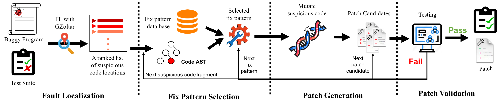
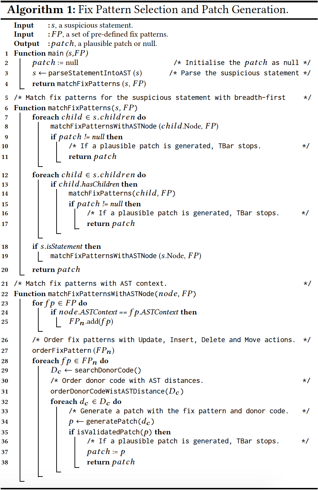

# GBar
Template-based automated program repair which is the extended version of TBar that can run on Vul4J dataset.


I. Requirement
--------------
 - Unix based OS.
 - [Java 1.7](https://www.oracle.com/java/technologies/javase/javase7-archive-downloads.html)
 - [Java 1.8](https://www.oracle.com/tr/java/technologies/javase/javase8-archive-downloads.html)
 - [Vul4J](https://github.com/tuhh-softsec/vul4j)
 - Maven 3~
 - Python 3~
 - [GZoltar](https://github.com/SerVal-DTF/TBar/tree/master/lib)
 - [SVN >= 1.8](https://subversion.apache.org/packages.html)
 - [perl >= 5.0.10](https://www.perl.org/get.html)

II. Overview of GBar
--------------------






III. Prepare Vul4J Bugs
---------------------------
 Download and Install Vul4J by following steps in the  [Vul4J repository](https://github.com/tuhh-softsec/vul4j) .
 
IV. Install & Prepare GZoltar
---------------------------
 Download and Install [GZoltar](https://gzoltar.com/).
 
 To see wether installation is complete try to run
  ```sh runGZoltar.sh VUL4J 10```
 
  
V. Run GBar
------------
 1. Create D4J/projects folder. 
 
 2. Create SuspiciousCodePositions folder.

 3. Run compileAllVul4j.sh (sh compileAllVul4j.sh) 
   - to create project folders in D4J/projects
 
 4. Run runGZoltarForAllVul4j.sh - make sure that loop contains all bug ids, if GZoltar does not work check step IV.
      (Check the SuspiciousCodePositions/$bug_id$/sfl/txt/ochiahi.ranking.csv)
      (Whether it is filled or not + whether the first lines have values bigger than 0)
      
 5. Run GBar with for loop extension

